# Week1Daily4NafisLocalizationApp
This is a localized application. User have to select one word to show that in the next page.

In my mother language, Bangla. First one has been selected and saved. Showed in Toast.
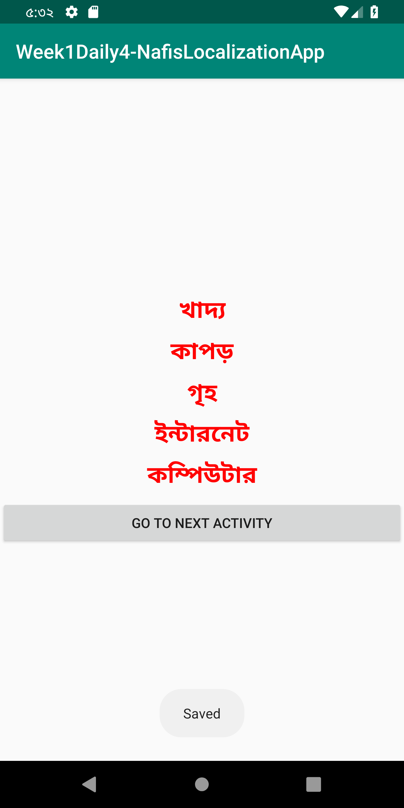
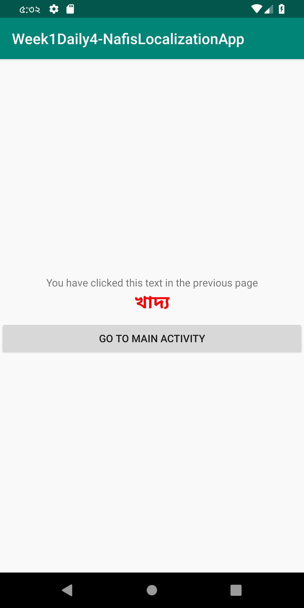

In Swedish
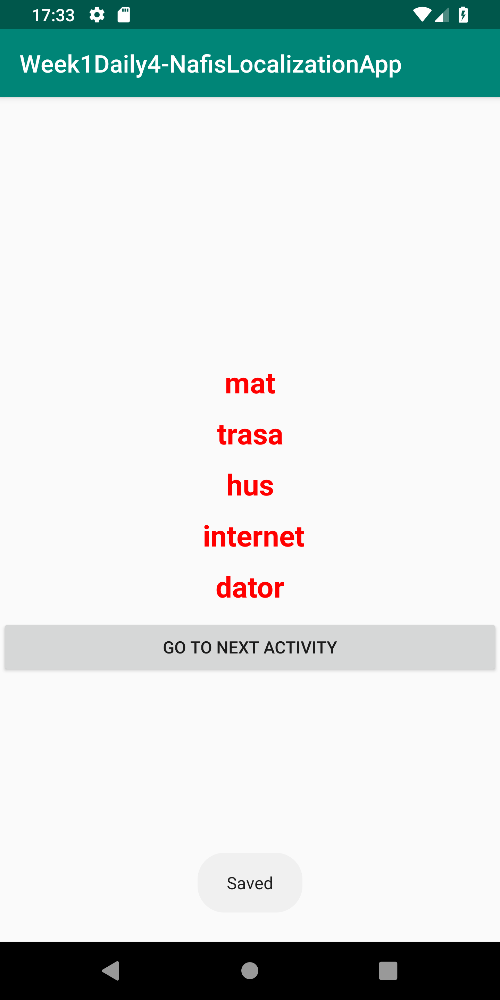
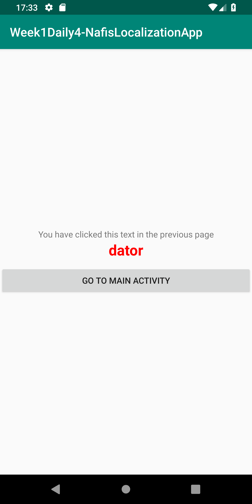

In Chinese
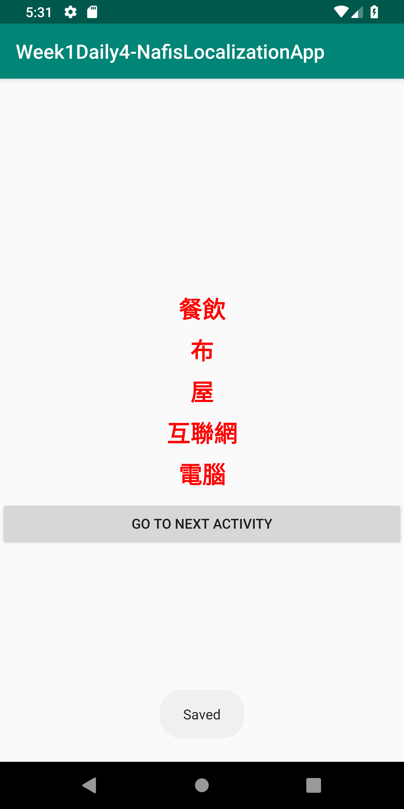
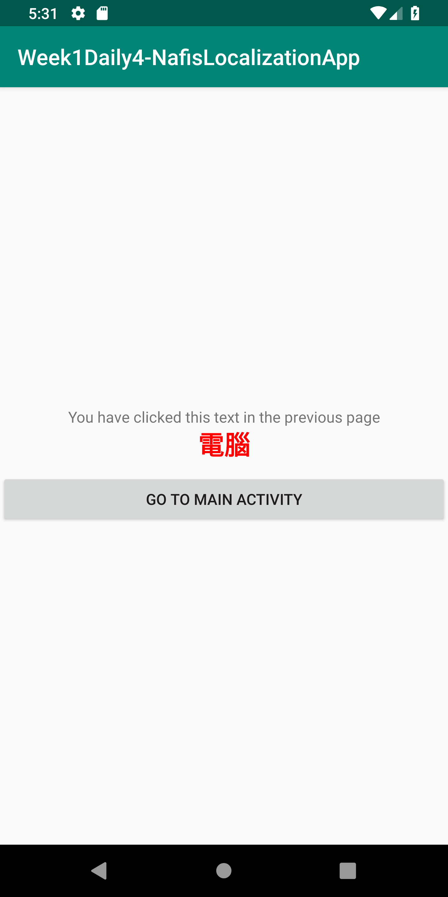

In French
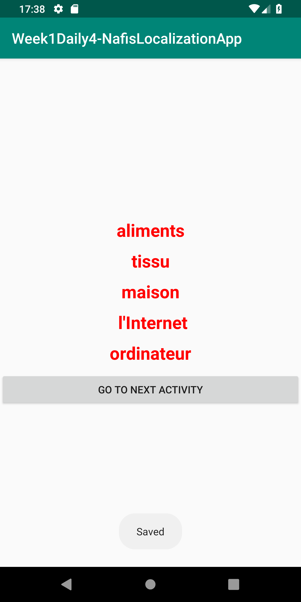
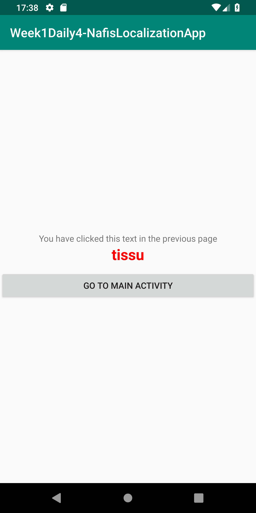

In Spanish
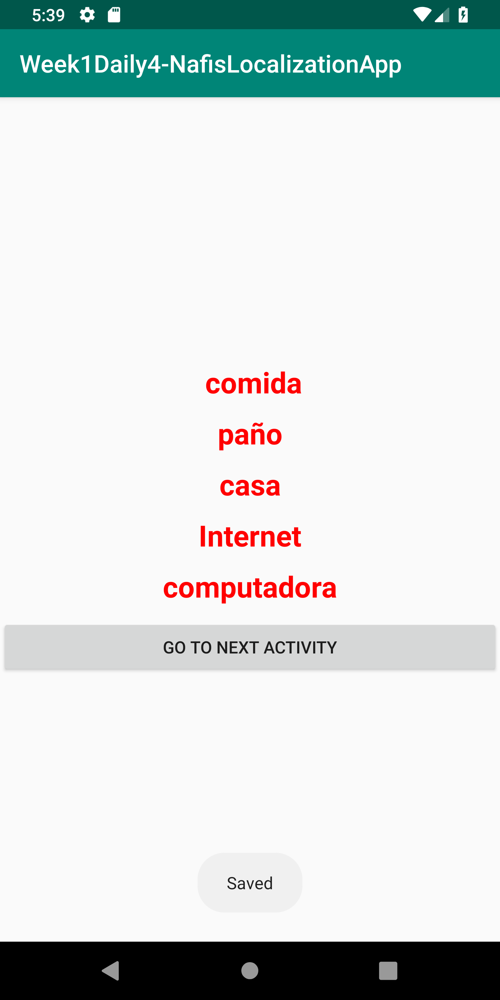
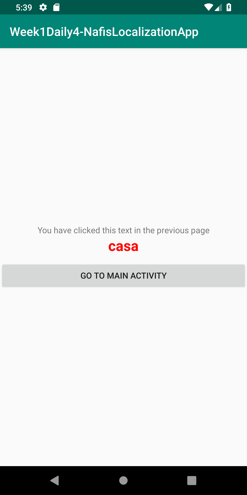

In English
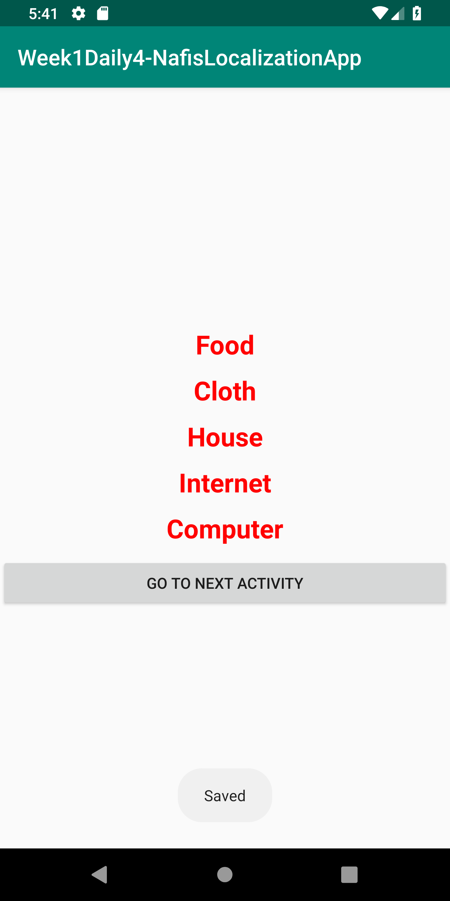
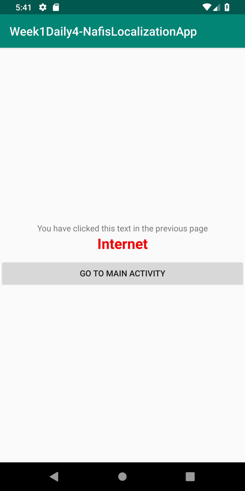
If user dont select any word, it will show pop up messege.
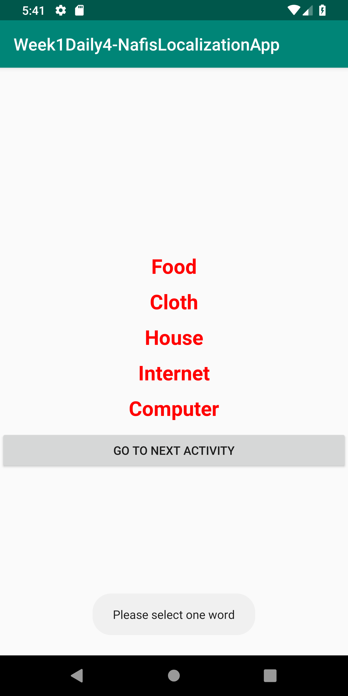
